# MARINA

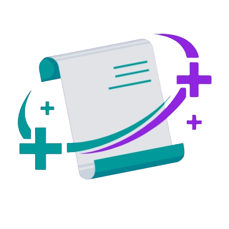

**M**oblie **A**pp fo**R** med**I**cal an**N**ot**A**tion

... but let’s be real: MARINA is my thesis turned codebase, where crowd-powered validation meets mobile magic.

I built this to fix one big issue: expert validation of health content is slow, pricey, and often impractical. Better to break it down into quick microtasks, ship them to users, and validate with the masses—fast, cheap, and way more fun.

## Screenshots

Here’s how MARINA looks in action. Each group of images corresponds to one of the app’s main tasks.

#### Microtask Flow

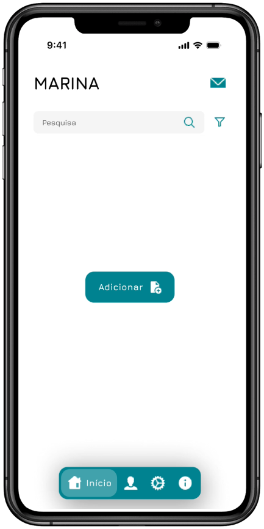 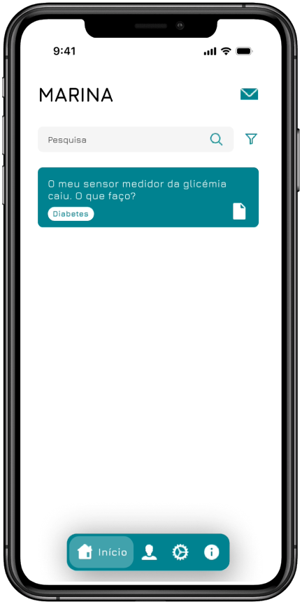 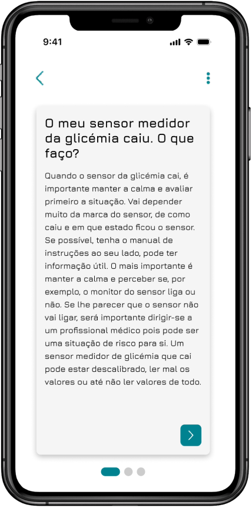

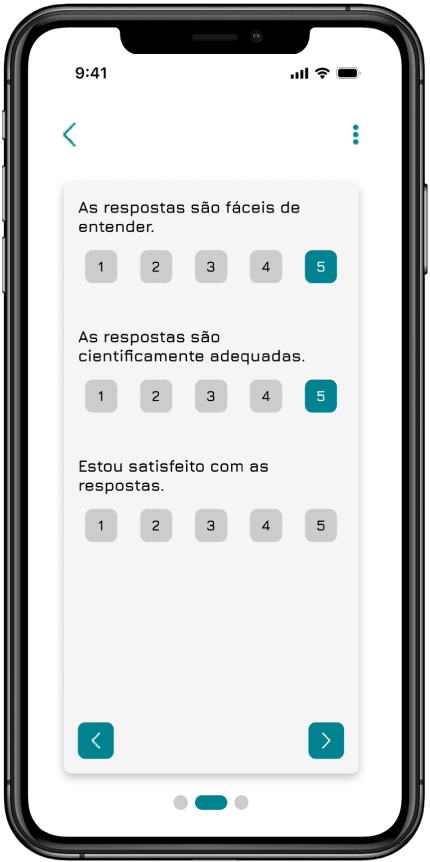 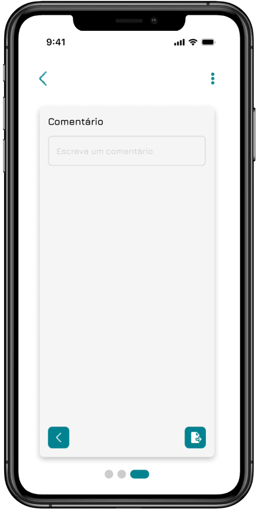 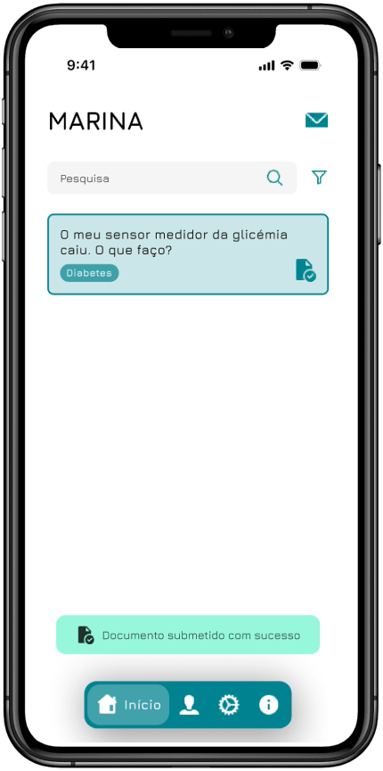

#### Notifications

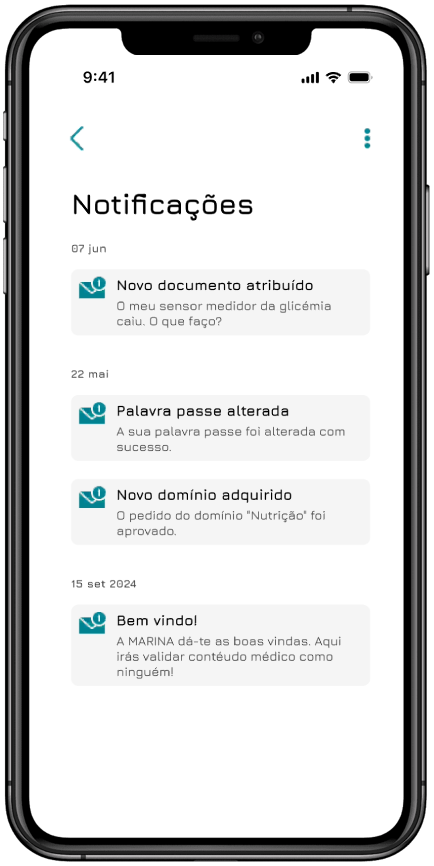 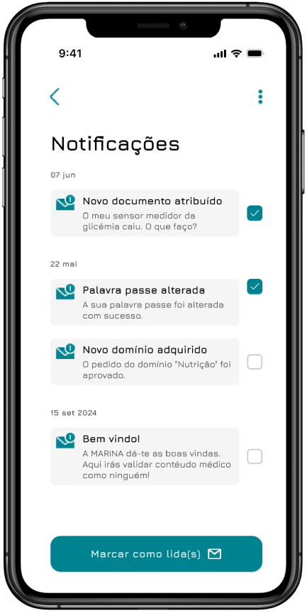 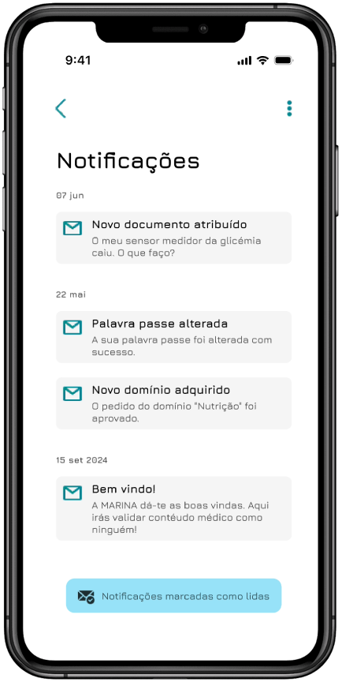

#### App Settings

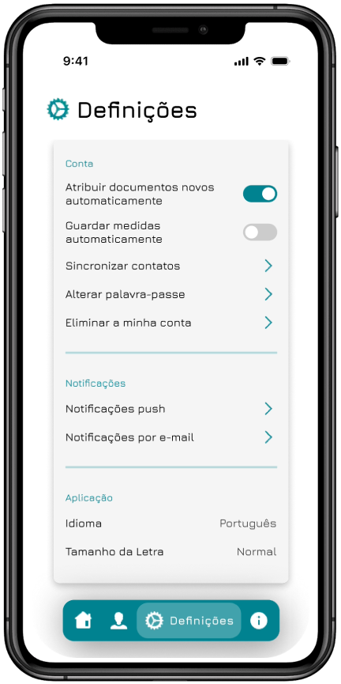 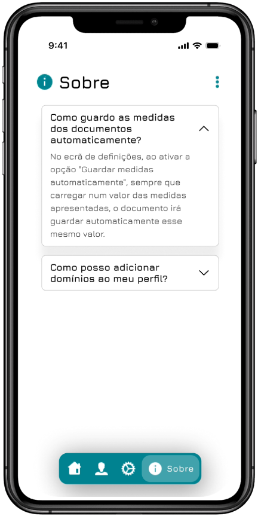

## What Actually Works

- Breaks down medical content validation into microtasks
- Users validate things on the go via a Flutter mobile app
- Backend runs on Node.js + Express, storing results in MongoDB
- Ready-made for feeding clean data into chatbots or NLP tools

## Tech Stack

- [Frontend](marina/): Flutter (Dart)
- [Backend](server/): Node.js + Express
- Database: MongoDB
- Features: REST API, JWT authentication, push notifications, gamification tied to user-centered design (UCD)

### Why This Exists

Traditional expert validation takes months and costs a fortune. Crowdsourcing it via mobile makes it way faster, more scalable, and surprisingly accurate. This is MARINA’s real-world experiment with diabetes educational materials, aimed at making health chatbots smarter and more trustworthy.

### Final Thoughts

What started as a research thesis turned into a legit app. Curious about UCD decisions, interface experiments, or validation results? Peek into the [documents](docs/) folder and dive in.
